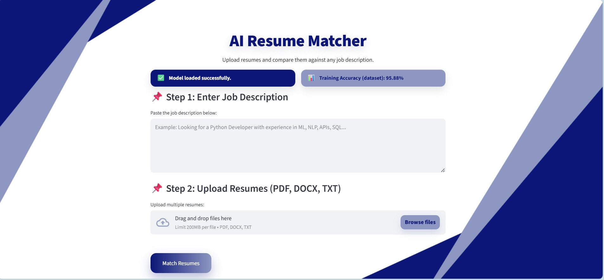
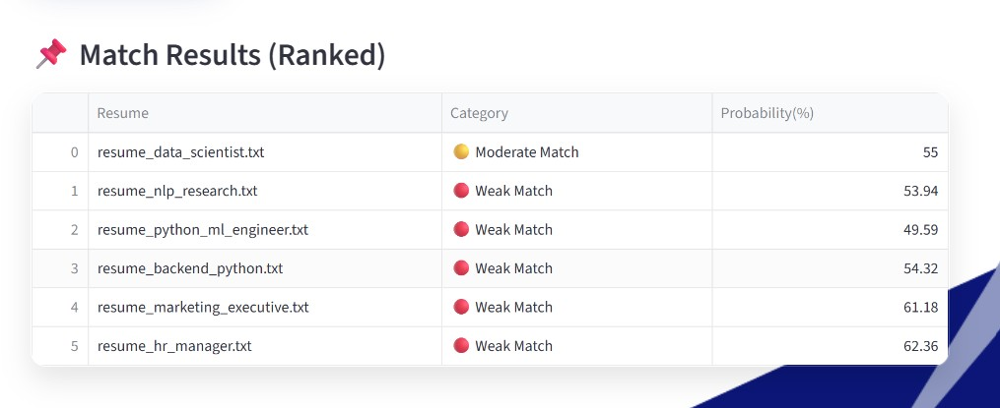

#  **AI Resume Matcher — NLP + Machine Learning + Streamlit**

An intelligent web application that matches resumes against job descriptions using:

- **TF-IDF + Logistic Regression (Machine Learning Model)**
- **Cosine Similarity for ranking**
- **Advanced Resume Parsing (PDF, DOCX, TXT)**
- **Beautiful Modern Streamlit UI**

This tool helps HR teams, recruiters, and developers quickly **rank resumes based on relevance**.

---

##  **Features**

###  Resume Matching (ML + NLP)
- Uses **TF-IDF vectorization**
- Trained **Logistic Regression** model
- Computes match **probability score (%)**
- Ranks resumes using cosine similarity + ML probability

###  Upload Multiple Resume Formats
- PDF  
- DOCX  
- TXT  

###  Modern Streamlit UI
- Custom background image
- Styled buttons and match result cards
- Clean centered layout

---

##  **UI Preview**

 
##  **Output**

  

###  Model Training
Automatically downloads dataset from **HuggingFace**.

Saves:
- `vectorizer.joblib`
- `classifier.joblib`
- `label_info.json`

---

## **Project Structure**
resume-matcher-ai/  
│  
├── assets/  
│   └── bggg.png  
│  
├── models/  
│   ├── classifier.joblib  
│   ├── vectorizer.joblib  
│   └── label_info.json  
│  
├── src/  
│   ├── config.py  
│   ├── data.py  
│   ├── evaluate.py  
│   ├── model.py  
│   ├── preprocess.py  
│   ├── resume_parser.py  
│   └── utils.py  
│  
├── app.py  
├── requirements.txt  
└── README.md  

---

##  **Installation & Setup**

###  Clone the Repository
git clone https:[[//github.com/Faiza-Akter/resume-matcher-ai.git](https://github.com/Faiza-Akter/resume-matcher-ai.git)]

cd resume-matcher-ai

###  Create a Virtual Environment

**Windows:**
py -m venv .venv

**Activate**:

PowerShell: .venv\Scripts\Activate.ps1

CMD: .venv\Scripts\activate.bat

**Mac/Linux:**
source .venv/bin/activate

###  Install Dependencies
pip install -r requirements.txt

---

## **Training the Model**

Run this command: python -m src.model --train

---

## **How It Works**

### Preprocessing
- Text cleaning  
- Stopword removal  
- Tokenization  
- Lemmatization  

### Feature Engineering
- **TF-IDF vectorization**
- **N-grams (1,2)**

### ML Model
- **Logistic Regression**
- Predicts **match probability (%)**

### Similarity Scoring
- Uses **Cosine Similarity**
- Categorizes results:
  - 🟢 Strong Match  
  - 🟡 Moderate Match  
  - 🔴 Weak Match  

---

## **App Flow**

1. Enter job description  
2. Upload one or multiple resumes  
3. Click **Match Resumes**  
4. View ranked table showing:
   - Resume Name  
   - Match Category  
   - Probability (%)  

---

##  **Tech Stack**

- Python  
- Streamlit  
- Scikit-Learn  
- Pandas / NumPy  
- NLTK  
- pdfplumber  
- python-docx  
- HuggingFace Hub  

---

